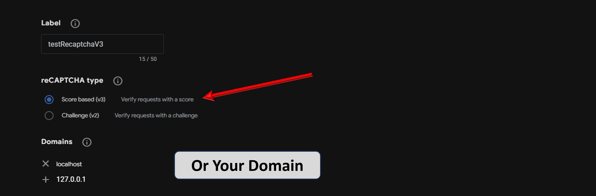
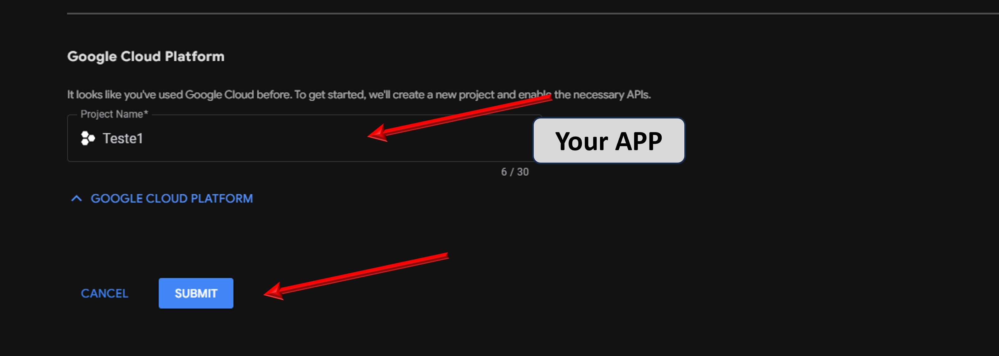
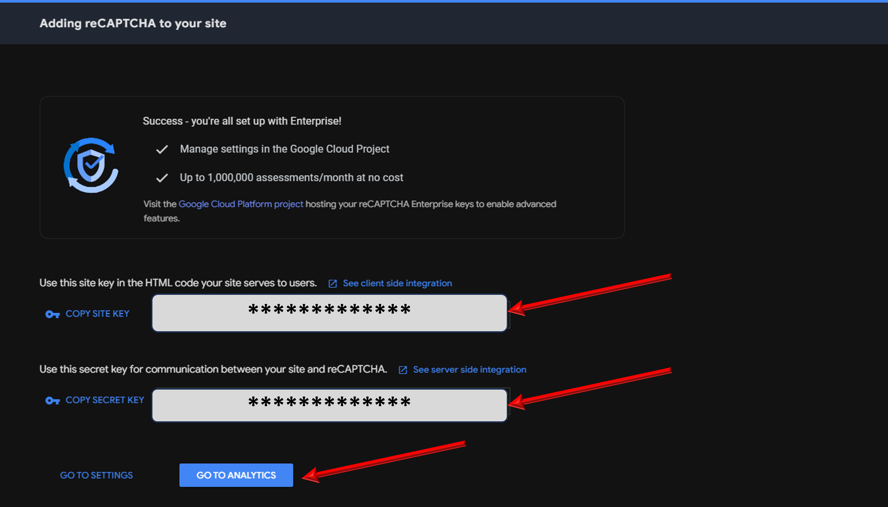

<h1>Tutorial Recaptcha V3 in App Flask</h1>

    Steps to Register RecaptchaV3 in Site

<a href="https://www.google.com/recaptcha/admin/create?hl=en-us">Link Google Recaptcha V3</a>

Add in file app_config!

